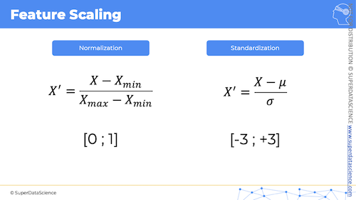

## High Level Overview of Machine Learning Process

### Data Pre-Processing

- Import Data (get it into a readable format like .csv, tables, rows, whatever).
- Clean the data (For this course, data comes pre-cleaned). This is an important part of ML Data PreProcessing
- Split data into training and test sets.

### Modelling

- Build the model
- Train the model
- Make predictions

### Evaluations

- Calculate performance metrics you want to use against your modeling
- Make a verdict (about the efficacy of model). Repeat process from start if needed.

#### Splitting Data into Training and Test Sets

- A generally accepted approach is to **train** on about **80%** of your dataset, while reserving the remaining 20% for the **test** set.
- Example: Hypothetical Car Sale Model where our _Independent (x)_ variables are age of car and mileage, and the _Dependent (y)_ variable is what the car sells for.
  Lets say we have 100 cars sold (invoices) as your dataset.
  80 of the car-sale (invoices) would be trained on, 20 of the sales (invoices) would be used to test.
- The _training set_ will be used to _build the model_.
- The _test set_ will be then taken and they have the model applied to it.
- Back to our car-sale example.
- The idea is you want to be confident that when you apply your model for the first time (or any time) that it will have never known or been aware of the test set data-points. Thereby giving you confidence you're effectively unit-testing the model. Back to our example. The 80 sales invoices <i>(of the training set)</i> will have been trained up hundreds of times already, but never using the 20 sales invoices we initially reserved/removed.

#### Feature Scaling

- <strong>Necessary to prevent different column values having disproportionate scales receive proportionate analysis, which often skews toward the column with the larger magnitude or larger scale-values</strong>
- For instance 3 employees (3 rows in this trivial example) have their age-salary attributes analyzed to determine the closer grouping of 2 employees. So the rows are the 3 employees and theres a column for salary, and a column for their age. _compares apple to oranges.. years to dollars.. So it has to be normalized_
- Note: Only detailing 2 of _many_ scale-methods here. And, these will only be applied to individual _columns_ (in a table layout of data), and never across columns (rows).
- Note 2: Even though the name of this process is called _feature_ scaling, the scaling can and should be applied to the dependent variable (y value) in certain situations. Check out the detailed notes at start of the [support_vector_regression notebook](../exercises/udemy_course_workbooks/9_support_vector_regression/support_vector_regression.ipynb) for an example of when to scale the dependent variables (the observed data).

- **Normalization:** Taking the minimum value in a column, then subtracting that value from every other value in the column, then dividing by the diff max value and min values. Will yield a value between 0 and 1 _[0;1]_

- **Standardization:**
- Similar to **Normalization** but subtracts the average from each value in column, then divides that max - average by the _standard deviation (sigma)_

