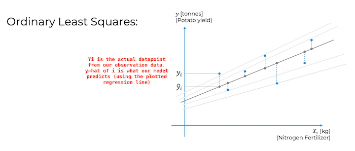
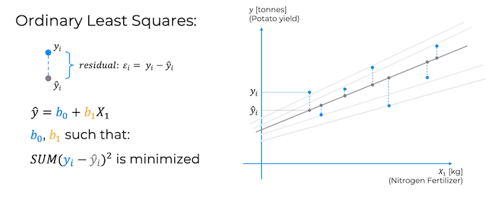

## Simple Linear Regression

- Well known Statistics-origin function used in machine-learning. Here's an _excellent_ excerpt from machinelearningmastery's [article](https://machinelearningmastery.com/linear-regression-for-machine-learning/) _(regarding why we use stats methods in ml):_

> Machine learning, more specifically the field of predictive modeling is primarily concerned with minimizing the error of a model or making the most accurate predictions possible, at the expense of explainability. In applied machine learning we will borrow, reuse and steal algorithms from many different fields, including statistics and use them towards these ends.

> As such, linear regression was developed in the field of statistics and is studied as a model for understanding the relationship between input and output numerical variables, but has been borrowed by machine learning. It is both a statistical algorithm and a machine learning algorithm.

- **When it's used:** Whenever _continuous values_ need to be predicted. Temperature, speed, number of things in a thing, etc.

#### Ordinary Least Squares method

- We might come up with several lines that fit our data points, but when we want to quickly find the _closest-to-best_ line, we can use the ordinary least squares method.
  

- In below definition we square the some of _residuals_ (differences / or could be thought of as distances between $y_i$ and $\hat y_i$)
  
