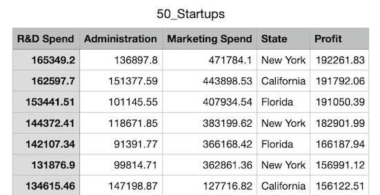
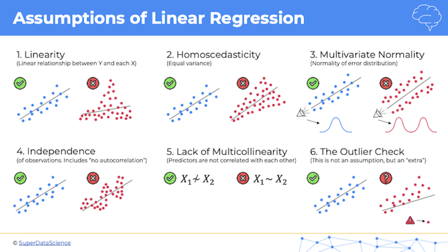

## Multiple Linear Regression

### Basics and Example Use Case

- When to use: Again whenver we need a continuous value to be predicted, we want to use a regression algorithm. With _multiple linear regression_ we can evaluate multiple independent variables, and maybe more importantly we can look at predictions from the model based on any single feature, holding all the others constant. In the image below we could make predictions for the Marketing Spend (for instance) feature that will produce the maximum profit (dependent variable), and then do the same for a different feature. Or, for a much more realistic evaluation, we could determine whether R&D spending or Marketing spending is a better predictor of total profit (max).

### Assumptions of (Linear) Regression (Important)

- Implementing a regression algorithm, whether simple or multiple or other, **requires** your data-set to be **fit** for using linear regression, or that your data-set exhibits linear relationships (between independent, dependent variables). Otherwise, you'll be literally trying to fit _'a square peg in a round hole'_.

- Following graphic illustrates the potential consequence of 'blindly' applying a regression algorithm to data that isn't fit for such algorithm. This type of 'fallacy' is known as [_Anscombe's quartet_](https://en.wikipedia.org/wiki/Anscombe%27s_quartet). See also [matplotlib's description](https://matplotlib.org/stable/gallery/specialty_plots/anscombe.html)

