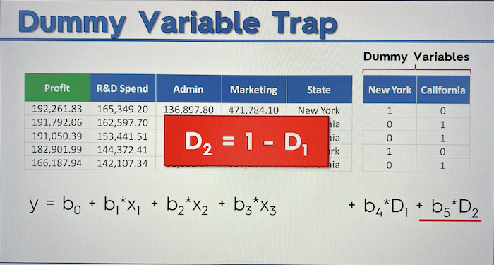
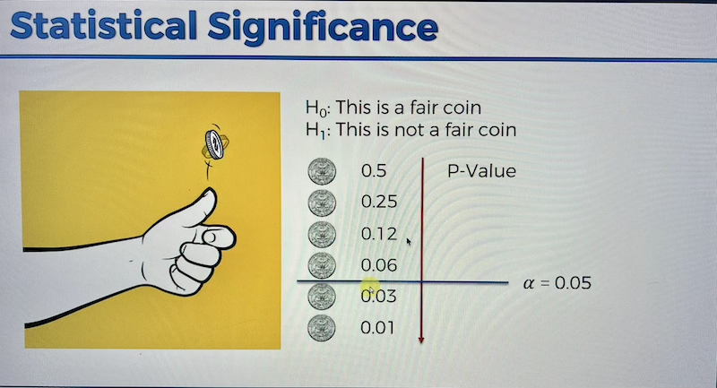

## Multiple Linear Regression

### Basics and Example Use Case

- When to use: Again whenver we need a continuous value to be predicted, we want to use a regression algorithm. With _multiple linear regression_ we can evaluate multiple independent variables, and maybe more importantly we can look at predictions from the model based on any single feature, holding all the others constant. In the image below we could make predictions for the Marketing Spend (for instance) feature that will produce the maximum profit (dependent variable), and then do the same for a different feature. Or, for a much more realistic evaluation, we could determine whether R&D spending or Marketing spending is a better predictor of total profit (max).
- Note 1: When using a multiple linear regression, there is _no need to scale features_. This is because in a multiple linear regression, each feature will have it's own coefficient, meaning that the coefficient will be tuned to compensate for any dominance in any one feature.

### Assumptions of Simple (Linear) Regression (Important)

- Implementing a simple-regression algorithm **requires** your data-set to be **fit** for using linear regression, or that your data-set exhibits linear relationships (between independent, dependent variables). Otherwise, you'll be literally trying to fit _'a square peg in a round hole'_.

- Interestingly, and _to note:_ _multiple linear regressions_ **do not** necessarily require your data to exhibit linear relationships (or any of the other simple-linear assumptions). With a _multiple linear regression_, go ahead and throw your data at it (so to speak), if the predictions perform poorly, you'll know you need to find a different ML model. **(Essentially this is a time-cost rule. It would end up being a waste of time to evaluate all of the assumptions on a multiple linear regeression, in the end you'll see the accuracy compared to other models, so just forego it)**

- Following graphic illustrates the potential consequence of 'blindly' applying a simple-regression algorithm to data that isn't fit for such algorithm. This type of 'fallacy' is known as [_Anscombe's quartet_](https://en.wikipedia.org/wiki/Anscombe%27s_quartet). See also [matplotlib's description](https://matplotlib.org/stable/gallery/specialty_plots/anscombe.html)

### [Dummy Variables](<https://en.wikipedia.org/wiki/Dummy_variable_(statistics)>) (One-Hot-Encoding)

- When we have categorical data in our features, we have to account for them in the regression formula. Dummy variables create column values with either a 1 _ON_ or 0 _OFF_ .
- However we don't want to include every converted-category column included in the regression. For instance if we have an original column 'States' that we _one-hot-encode_ to 2 columns (we only have 2 states in this example), the following graphic shows why we wouldn't include the California column (it's represented by the New York column being either ON or OFF).
- To remedy the trap-problem, you simply _remove one of the category columns_.. So in the case of our 2 state categories, you'd omit the red-underlined expression in image below. If we had 10 states in our data, we'd omit 1 and be left with 9 expressions to our multiple linear regression.

### Statistical Significance & [P-Value](https://en.wikipedia.org/wiki/P-value)

- To test your hypothesis, the easiest example would be in the coin-flip analogy, one hypothesis that assumes the coins have 2 sides, while the [_null hypothesis_](https://www.youtube.com/watch?v=fb8BSFr0isg) would assume that both sides are tails (or heads), so in this null world, getting a dozen tails in a row would be completely valid.
- Defined as the probability of obtaining test results at least as extreme as the realized (real) observation under the assumption that the [_null hypothesis_](https://en.wikipedia.org/wiki/Null_hypothesis) is correct.
- The coinflip analogy would have the null hypothesis being something like "Yes, I do expect to get tails a dozen times in a row (low probability with a _fair_ coin).
- Where you want to set your statistical significance level is up to you to decide, but something like 5% isn't uncommon. But it could be higher or lower depending on what type of results you're seeking.

