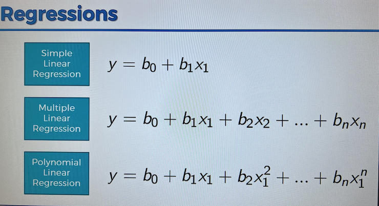
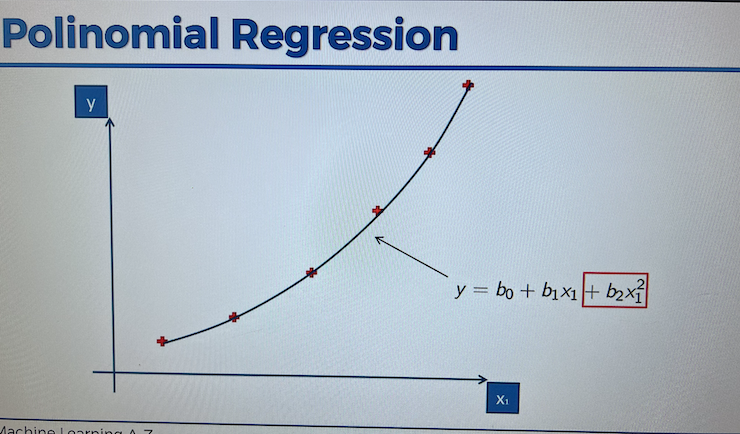

### Polinomial Linear Regression

#### Types Of Linear Regressions

- A polinomial linear regression is a version of the [_multiple linear regression_.](./7-multiple-linear-regression.md)
- Note in the polinomial regression, the feature(set) is the same one $x_1$, it is however squared, or raised to n-th power.
- Prominent example would be modeling any kind of pandemic or virus-infection data, and other more specific use cases.
  

- Being able to raise the variables to a power can sometimes better model your data than a simple or multiple linear regression can.
- Since your unknown elements of any of the machine-learning regression models are the _coefficients_ (and not the $X$ variables/predictors), this is still a type of _linear_ regression.

