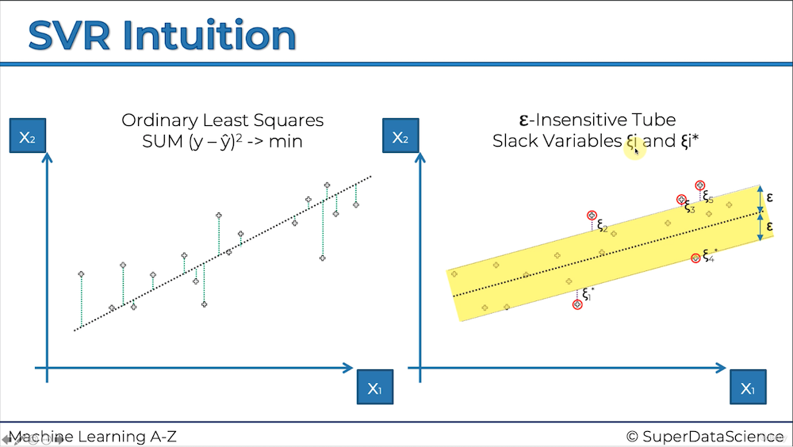

## Support Vector Regression / Machines

#### Linear Support Vector Regression

- Creates an 'Epsilon Insensitive Tube" $\epsilon$ _Epsilon-Insensitive-Tube_ around the simple linear regression creating what could be thought of as a _buffer_

- So wheras in Ordinary Least Squares regression the error between the predicted line and _each_ and _every_ observed datapoint was taken into account, in Epsilon-Insensitive-Tube regression, _only the furtherst_ datapoints outside the buffer-tube are considered in handling _error_ of the model.

- Excelelnt graphic by Super Data Science

