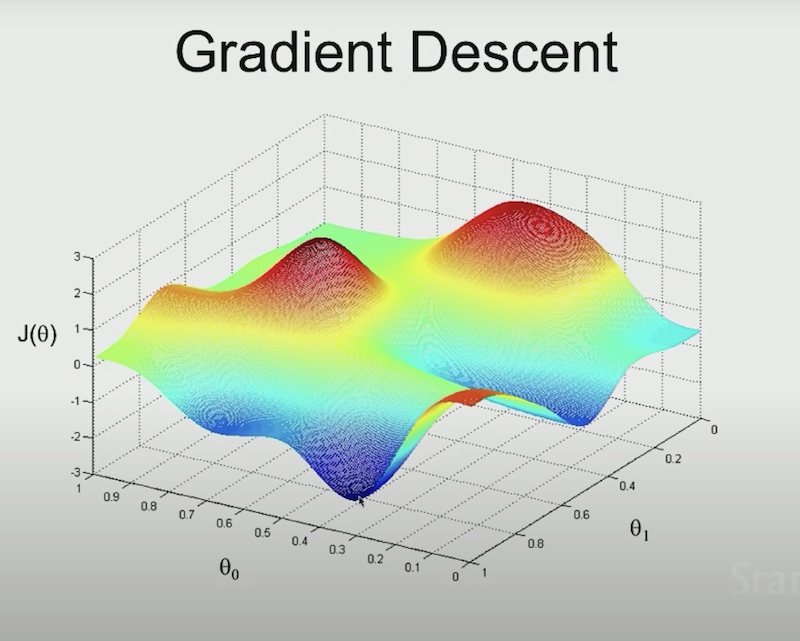

## ML Notes - Definitions

### Types of Algorithm Output

- _Regression_: Algorithm attempts to map set of input-feature(s) _x_ to a **continuous value** output _y_ . In contrast to a Classification algorithm which attempts to predict discreet class labels (e.g. true or false). Regression algorithms can of course also predict discreet values in the form of integers (for instance). Ex: _NavLab_ autonomous vehicle from Carnegie-Mellon uses regression to map the sensor input of the road to the continuous-output _y_ that the human labels through the training phase. (in other words there is no set of discreet values for a steering wheel to be put in..). Another classic example would be mapping things like house sqare-footage to sale-value.

- _Classification_: Algorithm attempts to map a function from set of input-features(s) _x_ to a **discreet value (class/label)** output _y_. Similar to how there is overlap with Regression algo's (having discreet outputs in the event of integers). Classification algos can also have continuous value outputs if they are used as labels/classes during training. A classic example would be an algorithm mapping input features of tumor size to output classes of either malignant, or benign. There is a discreet set of possible outputs, either yes, or no. (there can be any number of discreet values, and hence there is overlap between the two algorithms).

## Supervised Learning

### Description

- "Supervised learning (SL) is a paradigm in machine learning where input objects (for example, a vector of predictor variables) and a desired output value (also known as human-labeled supervisory signal) train a model. The training data is processed, building a function that maps new data on expected output values."

### Definitions

- _Features_: Features are _'x1,x2,...' values_ . The dimensions of input data for _supervised_ learning.

- _Labels_: Outputs _Y_ . Job of ML algorithm is to map _Labels_ to _Features_

## Unsupervised Learning

### Description

- Basically your leaning algorithm will attempt to make sense of inputs _x_ on it's own. Having no _y_ _labeling_ from a human.

## Definitions (Continued)

- _Clustering_: This is the algorithm used by Google News for instance to crawl news sites, and group together articles based on how close they cluster in subject matter.

### Bias and Variance

- [_Inductive Bias (Bias):_](https://www.geeksforgeeks.org/underfitting-and-overfitting-in-machine-learning/#:~:text=Bias%20refers%20to,model%2C%20indicating%20underfitting.) _When the features picked are low-relevancy or even no-relevancy, you are giving them the same amount of weight as those that are impactful._
- [_Varying the feature scale (Variance)._](https://www.geeksforgeeks.org/underfitting-and-overfitting-in-machine-learning/#:~:text=Variance%2C%20on%20the,data%2C%20indicating%20overfitting.) : _High *variance* occurs when a model learns the training data's *noise* and *random fluctuations* rather than the underlying pattern. As a result the model will perform well on the training data, but poorly on the testing data._
- Consider a prediction between being a ski or a snowboard. We have a data-training set of lengths in _cm_ and widths in _cm_ . The problem that we want to scale for is that the widths of the snowboard are far smaller scaled than the length of the skis.. think 170cm for skis but widths of snowboards are maybe 40cm .. meaning the difference between a snowboard at 42cm and one at 40cm is going to be represented only in it's comparison with the ski lengths.. which might be 170cm, another might be 140cm.. Which means the distance from sample ski to sample ski is much larger, and will be learned poorly.

---

## Basic Supervised Linear Regression Algorithm (also called Least Squares Algorithm)

#### Supervised Learning 'Work-Flow'

- **Training Set**: Your dataset. This step will involve several sub-steps like _data-cleaning_, and _feature-scaling_ among others.
  ->
- **Learning Algorithm**: The prepared _training set_ of data is fed into the learning algorithm, who's job it is to output the _function_ that will make the predictions sought.
  ->
- **Hypothesis** (function that makes prediction). Hypothesis is the function which then will take in unknown inputs (inputs not in the original training set) and produce the prediction outputs.

#### Mathemtatical Representation

$$ h(x) = \theta_0 + \theta_1x_1 + \theta_2x_2... $$

Where:

- $h(x)$ or _y_: Is the function output, the predicted value.
- $\theta_0$: Parameter, Is the y-intercept. The predicted value of y when x is at origin (0).
- $\theta_1$: Parameter, Is the regression coefficient. The amount of change in predicted in y for increases/decreases in x (If you only have 1 feature/independent variable, this is it.)
- $x_1$: The independent variable or _feature_ set. With just 1 feature, this would be the only _x_ .. however that's rarely the case.. thus ->
- $\theta_2$: Parameter, Is the 2nd (of _n_-possible) regression coefficients to the ->
- $x_2$: Is the 2nd feature set or independent variable set.
- ... and so on for increasing dimensions of features

- $x_0$ can be set to 1 in order to allow equally-sized vectors of both the _parameters_ $\theta$ and the _features_ $x$
- $\theta$: Are the _parameters_ of the learning algorithm. The job of the learning algorithm is _to choose parameters theta that allows you to make the best predictions_
- $m$: The number of training examples / rows in the table of data.
- $n$: The number of features for the supervised learning problem.
- $x$: features / inputs
- $y$: Output or _target variable_
- $(x,y)$: A single traininig example.
- $(x^(i), y^(i))$: I-th training example.
- Occasionally $h(x)$ will be written as $h_\theta(x)$ to show that the _hypothesis_ is a function of the _parameters_ $\theta$ (theta) **and** the _features_ $x$

### Process - Overall Approach Points

- You first want to ask yourself when designing the **Learning Algorithm** _"How do we want to represent the **Hypothesis(function)**?"_
- We want to choose (or have learning algorithm) choose values for $\theta$ (theta) such that $h(x) \approx y$ for training examples.
- To do this, we want to _minimize_ the _square_ **difference** between the hypothesis output predictions and our supervised labels $y$
- This can be written $(h_\theta(x ) - y)^2$
- To complete the **cost function**, add to the previous equation for minimizing the square difference between $\theta$ and the label or _target variable_ we sum all of our training examples. and add a convenience 1/2 constant.
- Fully written as: $J(\theta) = \frac{1}{2} \displaystyle\sum_{i=1}^{m}(h_\theta(x) - y)^2$
- We represent the cost function as $J(\theta)$

#### Gradient Descent Algorithm

- In our housing-prices to square-footage mapping example, we only have 2 features, which would produce 2D vectors. However we're intentionally setting $\theta_0$ and $x_0$ to 1 which will give us 3D vectors $[0,0,0]$ for example.
- But the idea is to start with _some_ initial value for $\theta$ .. An easy way would be set it to 0 $[0,0,0]$ since it's a 3D parameter set.
- Then, you'll continue to change $\theta$ to reduce the _cost function_ $J(\theta)$
- **Gradient Descent** analogy to how it operates is whichever initial starting point you provide (all 0's in our case), then the algo _'looks'_ in all 360 degrees around it, and determines which direction to _'step'_ to go _downhill_ **as fast as possible**, the algorithm will then take that _'step'_ downhill. Repeat.
- See the illustration below

- Problems can arrise applying gradient descent to linear regression include (because of the starting point you may have picked) you will find different local minima (look at image and notice both depressions.. either could have been picked to 'step' into.. but theres only one that is actually lowest).
- Gradient Descent can be generalized as follows where the $:=$ is an **assignment** operation (not equality expression). We'll use lowercase $j$ to represent the nth parameter being worked on, We'll use $\alpha$ to denote the _leaning rate_ which is just how _fast_ or _short_ we want each step to be (allowing tuning of acceptable accuracy)
- $\alpha$: The learning rate, should be tried out at lower / finer rate to start. Lest you overshoot or 'overstep' the minima.

## Basic Supervised Linear Regression Algorithm

- **Training Set**: Your dataset. This step will involve several sub-steps like _data-cleaning_, and _feature-scaling_ among others.
  ->
- **Learning Algorithm**: The prepared _training set_ of data is fed into the learning algorithm, who's job it is to output the _function_ that will make the predictions sought.
  ->
- **Hypothesis** (function that makes prediction). Hypothesis is the function which then will take in unknown inputs (inputs not in the original training set) and produce the prediction outputs.
