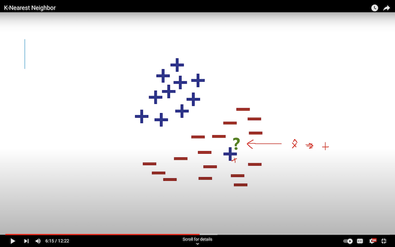
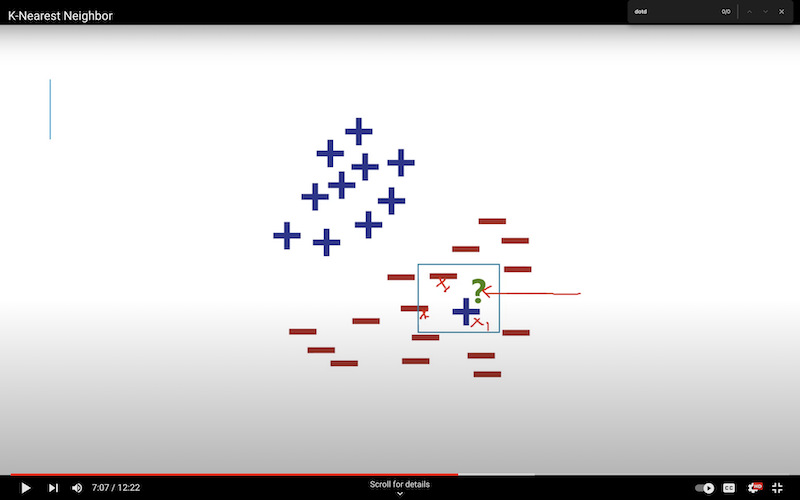
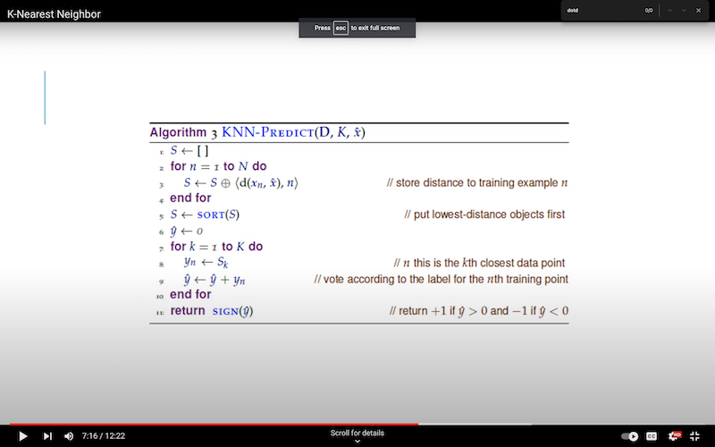

### Nearest Neighbor (and additional K-Nearest..) Algorithm

- Be sure to [look at _'shortcomings'_ to the algorithm](#potential-shortcomings) below because it contains definitions on over and underfitting the model.
- Very simple concept. For each test _example/sample_ $\hat{x}$ _'x-hat'_, the model should simply measure the distance to the _most similar_ input/vector that's already been mapped/predicted to an output-label $\hat{y}$. In practice in machine learning, the _closest_ vector will be analyzed, and it's mapped $\hat{y}$ will be used.
- At training time, store the entire training set.
- At test time, evaluate the test case as stated in first point above.
- Nearest Neighbor is prone to _overfitting_: over-trained to the point that _noises_ and _artifacts_ are included rather than considering only the useful information/data.
- Consider the following image [(again from this great youtube channel.)](https://www.youtube.com/@machinelearninglessons9276). We see a random $+$ label has found it's way into the model. If our test example/sample were to be where the question mark $?$ were, the base nearest-neighbor approach would pick that closest $+$ and would predict a $+$, when that is highly unlikely given the surrounding $-$ labels, and their distribution.

  

- What we actually want our model to be able to do is have the _nearest space_ analyzed to better fit the whole context and not just reflexively return what the closest example returns.

#### K-Nearest Neighbor:

- Instead let's train our model on the _3_ nearest neighbors, as shown in the following image. Then we will correctly predict a $-$ since 2 of the 3 nearest are $-$ labels.

- Detailed compute instructions below:

1 Calculate the distance between the test sample/example and _every other_ training sample/example, and store them.
2 Sort the list of distances.
3 For the $K$ that you pick, let's say 3 for example. Loop through that number _(3 iterations in our ex)_, using the $+$ and the $-$ labels from the previous example, you can easily then just assign a value of $1$ to each sign, add them up, the sum will be either positive or negative, and that's your answer/prediction. So for 2 $+$ and 1 $-$ we'd have return $-1$

#### Potential Shortcomings:

- K-Nearest Neighbor assumes that nearby points should have the same label.
- All features are evaluated equally. This can cause problems if all features are not meant or should not be evaluated all equally.
