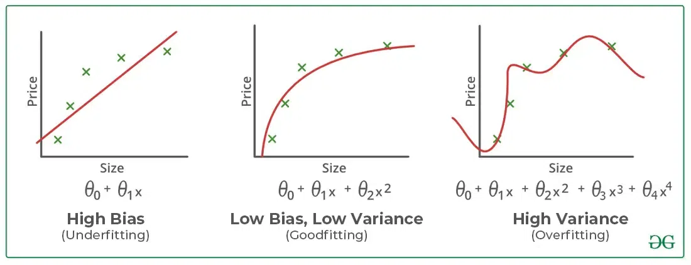

### Nearest Neighbor (and additional K-Nearest..) Algorithm

- Be sure to [look at _'shortcomings'_ to the algorithm](#potential-shortcomings) below because it contains definitions on over and underfitting the model.
- Very simple concept. For each test _example/sample_ $\hat{x}$ _'x-hat'_, the model should simply measure the distance to the _most similar_ input/vector that's already been mapped/predicted to an output-label $\hat{y}$. In practice in machine learning, the _closest_ vector will be analyzed, and it's mapped $\hat{y}$ will be used.
- At training time, store the entire training set.
- At test time, evaluate the test case as stated in first point above.
- Nearest Neighbor is prone to _overfitting_: over-trained to the point that _noises_ and _artifacts_ are included rather than considering only the useful information/data.
- Consider the following image [(again from this great youtube channel.)](https://www.youtube.com/@machinelearninglessons9276). We see a random $+$ label has found it's way into the model. If our test example/sample were to be where the question mark $?$ were, the base nearest-neighbor approach would pick that closest $+$ and would predict a $+$, when that is highly unlikely given the surrounding $-$ labels, and their distribution.

  

- What we actually want our model to be able to do is have the _nearest space_ analyzed to better fit the whole context and not just reflexively return what the closest example returns.

#### K-Nearest Neighbor:

- Instead let's train our model on the _3_ nearest neighbors, as shown in the following image. Then we will correctly predict a $-$ since 2 of the 3 nearest are $-$ labels.

- Detailed compute instructions below:

1 Calculate the distance between the test sample/example and _every other_ training sample/example, and store them.
2 Sort the list of distances.
3 For the $K$ that you pick, let's say 3 for example. Loop through that number _(3 iterations in our ex)_, using the $+$ and the $-$ labels from the previous example, you can easily then just assign a value of $1$ to each sign, add them up, the sum will be either positive or negative, and that's your answer/prediction. So for 2 $+$ and 1 $-$ we'd have return $-1$

#### Potential Shortcomings:

- K-Nearest Neighbor assumes that nearby points should have the same label.
- All features are evaluated equally. This can cause problems if all features are not meant or should not be evaluated all equally.
- [_Inductive Bias (Bias):_](https://www.geeksforgeeks.org/underfitting-and-overfitting-in-machine-learning/#:~:text=Bias%20refers%20to,model%2C%20indicating%20underfitting.) _When the features picked are low-relevancy or even no-relevancy, you are giving them the same amount of weight as those that are impactful._
- [_Varying the feature scale (Variance)._](https://www.geeksforgeeks.org/underfitting-and-overfitting-in-machine-learning/#:~:text=Variance%2C%20on%20the,data%2C%20indicating%20overfitting.) : _High *variance* occurs when a model learns the training data's *noise* and *random fluctuations* rather than the underlying pattern. As a result the model will perform well on the training data, but poorly on the testing data._
- Consider a prediction between being a ski or a snowboard. We have a data-training set of lengths in _cm_ and widths in _cm_ . The problem that we want to scale for is that the widths of the snowboard are far smaller scaled than the length of the skis.. think 170cm for skis but widths of snowboards are maybe 40cm .. meaning the difference between a snowboard at 42cm and one at 40cm is going to be represented only in it's comparison with the ski lengths.. which might be 170cm, another might be 140cm.. Which means the distance from sample ski to sample ski is much larger, and will be learned poorly.

