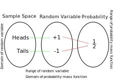

### Random Variables

- Definition: A function that maps from the set of sample spaces to a set of real numbers. Random variables are defined over a sample space of any random experiment. Values of random variables correspond to the outcomes of the random experiment. There are two basic types of random variables,

- In the classic analogy of a coin flip experiment, we can define the _Sample Space_ as all possible outcomes of the experiment (Either heads, or tails for a single flip _and assuming a fair coin_). We can then define the _Random Variable_ as merely being the function, or mapping of sample-space outcomes to _real number values_ (the _probability_).

