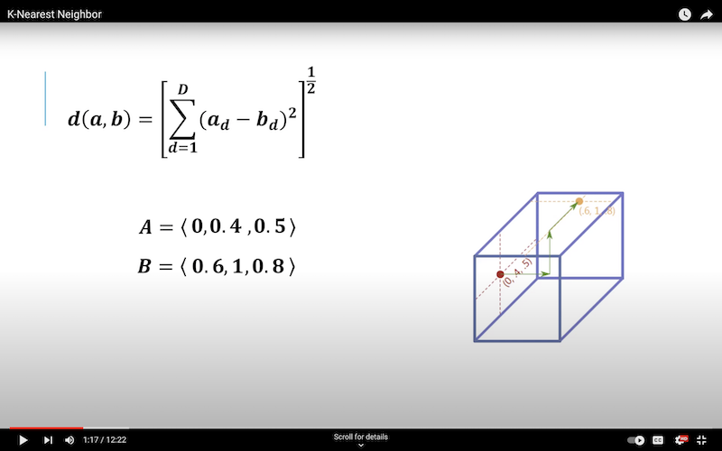
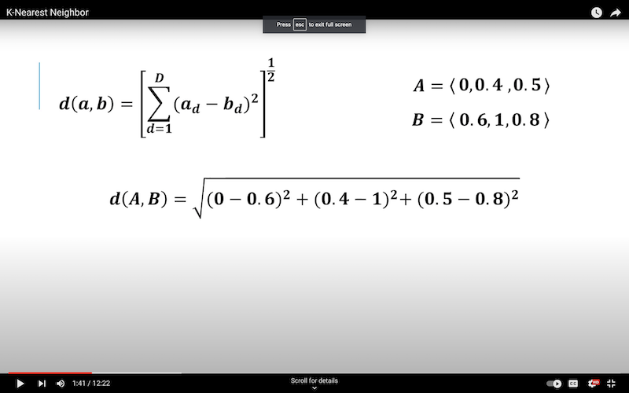

## Basic Math For ML (Review and New)

#### Vectors

- In CS we can think of these as just a list of attributes on an object. In space they are magnitudes with direction (in a classic 2D sense). _Or better put in the physics/algebra since they are objects that move you around physical space._
- Consider the following example of a single house:

```
floor_space = 120m^2
bedrooms = 2
bathrooms = 1
price = 150,000

```

$\begin{bmatrix} 120 \\
2 \\
1 \\
150 \end{bmatrix}$

- Vectors can be notated with a bar: $\bar{a}$
- Addition and subtraction on vectors can be done on each component, pretty straightforward. Just add straight across the vectors.
- Multiplication of a scalar on a vector produces expected results, a negative coefficient will flip the vector's direction.
- Use Pythagorean theorum to calculate a vectors size.

- _The length of a vector is also known as its *size*_
- While easily applied to spatial directions (Like x (or a for right triangle axis), y (or b) 2D coordinate space), this rule that for the **vector-size** $r$ : $\begin {bmatrix}r\end{bmatrix} = \begin{bmatrix} a \cr b\end{bmatrix}$ _or_ $\begin{bmatrix}r\end{bmatrix} = \sqrt{a^2 + b^2}$

- Excellent, concise review video can be [found here.](https://youtu.be/Ej3ZVxljJfo?si=T5dsVsf9ZgtvmeNQ)

- A _normalized_ vector is notated with a hat. It has a length of 1.
- The _dot product_ of two vectors results in a scalar.. So it's a.k.a the 'scalar product'. It can be written $\bar{a} \bullet \bar{b} $
- For 2-dimensional vector space the _dot product_ would be expressed: $\bar{a} \bullet \bar{b} = a_xb_x + a_yb_y$
- The _dot product_ of $n$ dimensions can be expressed: $\bar{a} \bullet \bar{b} = a_1b_1 + a_2b_2 + \dots + a_nb_n$

##### Finding Euclidean Distance Between Feature Vectors

- Credit to the @machinelearninglessons9276 channel on [youtube found here,](https://www.youtube.com/@machinelearninglessons9276) for the following images (and great videos).
- In a 3-Dimensional vector space, the operation can be visualized with the following image.
  
- And simplified further:
  
- Eventually we solve the distance between the above as $\sqrt{.81}$ or $0.9$
